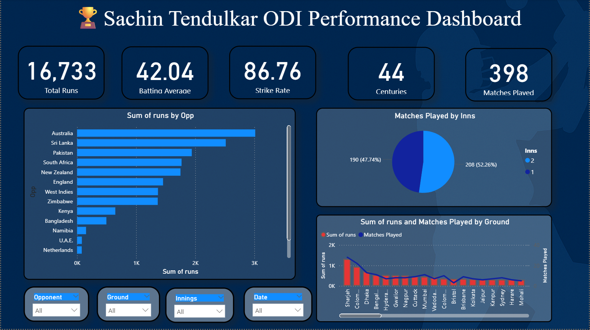

# Sachin_Tendulkar_odi_performance_analytics
# 📊 Sachin Tendulkar ODI Performance Analytics | Power BI

## 🚀 Project Overview

This project presents an **end-to-end data analytics solution** to analyze the One Day International (ODI) batting performance of Sachin Tendulkar using **Power BI**.

The objective of this project is to transform raw cricket performance data into meaningful business insights through:

- Data Cleaning
- Data Transformation (ETL)
- Dimensional Data Modeling
- Analytical Dashboard Development
- Interactive Business Intelligence Reporting

This project demonstrates how sports performance data can be converted into an analytical decision-support system using modern BI tools.

---

## 🎯 Problem Statement

Cricket performance datasets often contain large volumes of unstructured match-level statistics which are difficult to interpret without analytical modeling.

The goal of this project is to:

- Analyze ODI batting performance across different opponents
- Evaluate performance based on match innings
- Understand ground-wise performance trends
- Identify key performance metrics across career span
- Enable dynamic filtering for exploratory analysis

---

## 🛠️ Tools & Technologies Used

| Tool / Technology | Purpose |
|-------------------|--------|
| Power BI          | Data Visualization & Dashboarding |
| Power Query       | Data Cleaning & Transformation |
| DAX               | KPI Calculation & Data Analysis |
| Dimensional Modeling | Star Schema Design |
| Excel Dataset     | Source ODI Match Data |

---

## 🏗️ Data Modeling Approach

A **Dimensional Data Model (Star Schema)** was implemented to ensure efficient analytical querying.

### Fact Table:
- ODI Match Performance Data

### Dimension Tables:
- Dim_Date
- Dim_Opponent
- Dim_Ground
- Dim_Innings

This modeling approach improves:

- Query Performance  
- Scalability  
- Analytical Capability  
- Data Consistency  

---

## 📈 Key Performance Indicators (KPIs)

| Metric | Value |
|--------|-------|
| Total Runs Scored | 16,733 |
| Batting Average   | 42.04  |
| Strike Rate       | 86.76  |
| Total Centuries   | 44     |
| Matches Played    | 398    |

---

## 📊 Dashboard Insights

The interactive dashboard provides:

✅ Opponent-wise Run Distribution  
✅ Innings-wise Match Analysis  
✅ Ground-wise Performance Trends  
✅ Career Aggregated Metrics  
✅ Dynamic Slicer-based Filtering  

Users can filter data based on:

- Opponent  
- Ground  
- Match Date  
- Innings  

---

## 📷 Dashboard Preview

---

